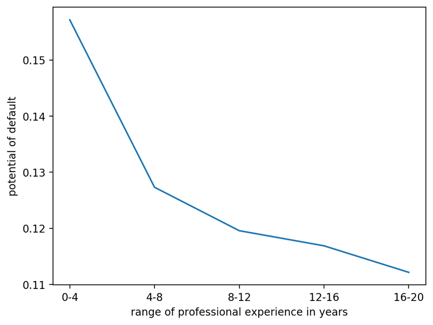
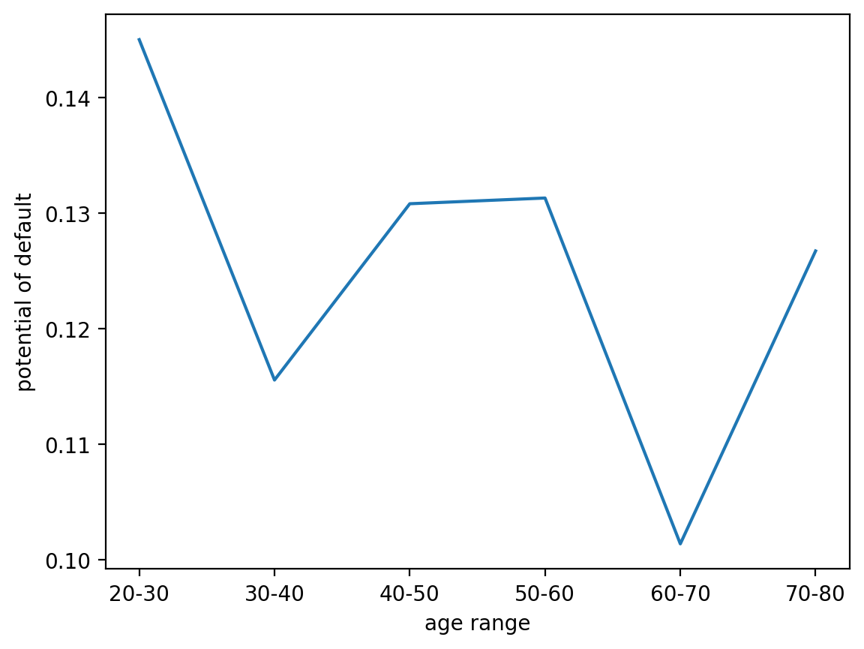
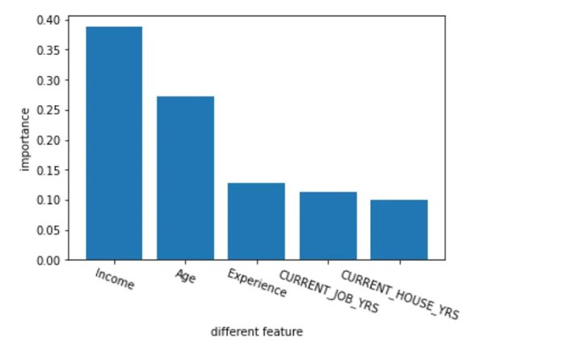

# **Team 11 final project**

## Relationship Between Profession Experience and Default Possibility

* The figure shows that there is a significant negative correlation between years of work experience and default rate. 

* The group with 0-4 years of work experience had the highest default rate (15.716%), and the group with 16-20 years of work experience had the lowest default rate (11.214%).
## Default Ratio of Different Age Groups

* The picture does not show a clear relationship between default rates and age

* The default rate is the lowest in 60-70 age group(10.138%) and the highest in20-30 age group(14.504%).The gap between the default rate of 40-50 and 50-60 age groups is small(about 0.0004948).

# Further study
***

* Algorithm:Using the random forest algorithm to rank the importance of some features 
* The importance of these features on the impact of loan default results is ranked as follows:
1. Income
2. Age 
3. Experience 
4. Current_job_years 
5. Current_house_years
* Score for the training data set : 98.29%
* Score for the testing data set : 87.87%

